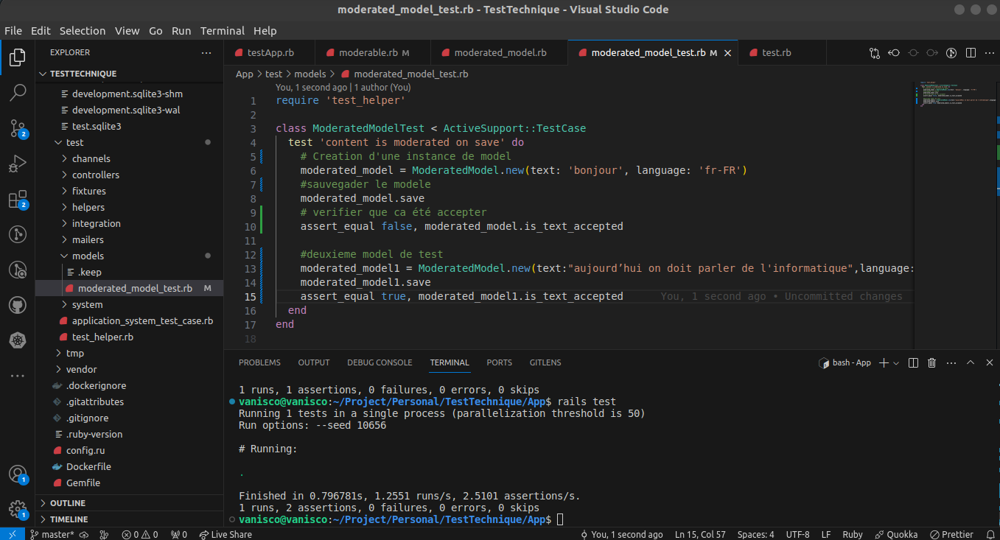
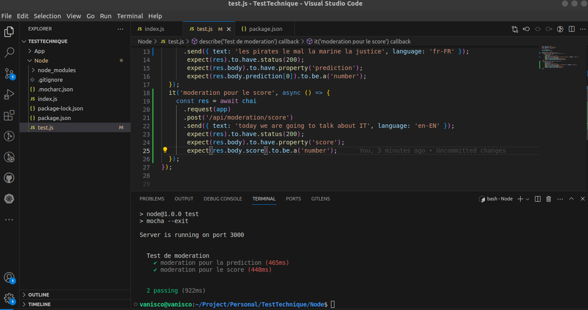

# Test du model de prediction en Rails et Node js Sur l'api de prediction de Logora

# Test Rails
Le but du test est d'écrire un module qui permet de modérer automatiquement les attributs d'un modèle Ruby on Rails. 
La modération consiste à rejeter les contenus haineux ou contraires à la loi grâce à notre API de modération.
# Resultat 

# Test Node js
Mettez en place un serveur Node.js qui écoute sur le port 3000 et qui gère les routes suivantes en utilisant l'API Logora de modération (https://moderation.logora.fr/docs) :  - POST /api/moderation/predict : pour obtenir une prédiction de modération basée sur le contenu textuel. Retourne une probabilité que le contenu devrait être rejeté. Paramètres : text, language
    - POST /api/moderation/score : pour obtenir un score de qualité basé sur le contenu textuel et les votes. Paramètres : text, language

# Resultat

